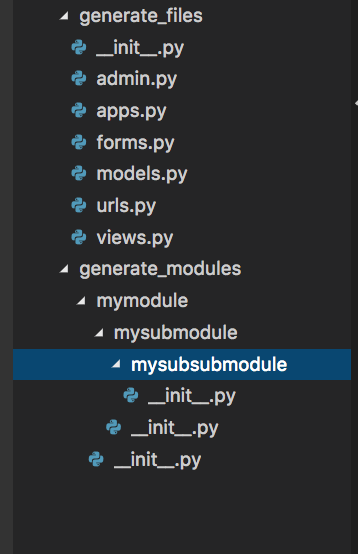

# Py Files Generator

## Introduction

This extension help Python developers to generate a module/submodules tree filled with the __init__.py file.

The extension can also be customized with a set of generators each one with a list of files to generate.

By default, **Py Files Generator** generates a directories tree and put a `__init__.py` file in each.

## Create custom generators

You can add your custom generators by adding them to your settings file.

## Usage

To activate the extension right-click on a folder in the explorer pane: 

Choose `Python files generator...` from the context menu.

From the quick pick menu choose the generator you want to use:

### Generate python modules

Choose `Python modules` from the quick pick menu and then type the path you want to generate:

Type `enter` and the modules will be generated.

### Invoke custom generator

Choose the generator you want from the quick pick menu. For example choose `Django App files`:

And your file will be generated.

